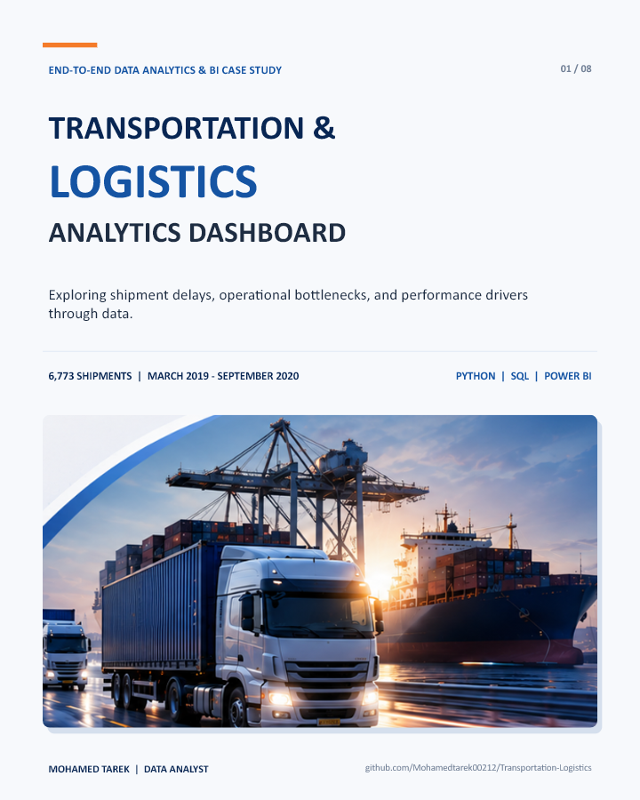
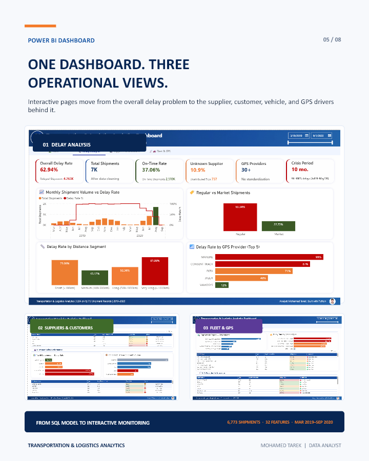

# Transportation & Logistics Analytics

End-to-end data analytics and business intelligence case study focused on shipment delays, operational bottlenecks, and logistics performance.



## Business Problem

The project investigates why shipments are delayed, where operational bottlenecks occur, and which routes, GPS providers, vehicle types, suppliers, and customers require intervention.

## Project Scope

- Clean and validate the transportation dataset.
- Explore delay patterns through Python EDA.
- Design a relational SQL Server database for logistics operations.
- Build reusable SQL queries for operational and financial analysis.
- Develop Power BI pages for delay, partner, fleet, and GPS monitoring.
- Translate the findings into practical business recommendations.

## Dataset Overview

| Metric | Value |
|---|---:|
| Cleaned shipment records | 6,773 |
| Features analyzed | 32 |
| Analysis period | March 2019 to September 2020 |
| Delayed shipments | 4,263 (62.94%) |
| On-time shipments | 2,510 (37.06%) |

## Tools

- Python: pandas, NumPy, Matplotlib, Seaborn, SciPy
- Microsoft Excel
- SQL Server and T-SQL
- Power BI
- PowerPoint

## Analytical Workflow

```text
Raw Data -> Data Cleaning -> EDA -> SQL Database -> Power BI -> Recommendations
```

## SQL Database Solution

The SQL layer is a designed solution and proof of concept built on top of the historical analysis. It contains 13 relational tables centered on `Shipments`:

- Reference data: `Countries`, `ShipmentStatusLookup`, `FailureReasonLookup`, `MaterialLookup`
- Business entities: `Hubs`, `Customers`, `Employees`, `Couriers`
- Transactional data: `Shipments`, `Payments`, `TrackingEvents`, `DeliveryAttempts`, `ProofOfDelivery`

The final script also includes 10 analytical queries covering shipment history, hub throughput, courier success, delivery failures, late shipments, stuck shipments, proof of delivery, and revenue.

The historical shipment dataset is the evidence base for the EDA and Power BI findings. The operational tables `TrackingEvents`, `DeliveryAttempts`, `Payments`, and `ProofOfDelivery` are assumed/demo transactional tables created to test the proposed database design and query layer. They demonstrate how a future live tracking system could capture operational history; they are not used to recalculate the historical delay KPI.

## Power BI Dashboard

The dashboard is organized into three operational views:

1. Delay Analysis
2. Suppliers & Customers
3. Fleet & GPS



## Key Findings

- 62.94% of the cleaned shipment records were delayed.
- Very long routes recorded an 81.08% delay rate, while short routes recorded 73.08%.
- GPS-provider delay rates varied from 12% for VAMOSYS to 99% for MANUAL tracking.
- The 32 FT single-axle 7MT and 40 FT 3XL trailer 35MT vehicle types recorded delay rates above 80%.
- K. Ramachandran recorded a 95.38% supplier delay rate.
- Ford India recorded a 73.35% customer delay rate.

## Recommendations

- Apply route-specific controls to high-risk distance segments.
- Standardize GPS provider names and reduce manual tracking.
- Review dispatch, maintenance, load planning, and route assignment for high-risk vehicle types.
- Establish service-level ownership and root-cause reviews for high-risk partners.
- Use Power BI as a recurring management and exception-monitoring system.

## Repository Structure

```text
data/           Raw and cleaned Excel datasets
notebooks/      Python EDA notebook
sql/            Database script, source tables, and query evidence
power-bi/       PBIX file and dashboard screenshots
docs/           ERD, Arabic report, and business narrative
presentation/   Case study in PDF and PowerPoint formats
assets/images/  Images used in this README
```

## Explore the Project

- [EDA notebook](notebooks/transportation-logistics-eda.ipynb)
- [SQL database script](sql/transportation-logistics-database.sql)
- [Database ERD](docs/database-erd.md)
- [Power BI dashboard file](power-bi/transportation-logistics-dashboard.pbix)
- [Arabic analytical report](docs/transportation-logistics-report-ar.pdf)
- [Case study PDF](presentation/transportation-logistics-case-study.pdf)

## Running the Notebook

```bash
pip install -r requirements.txt
jupyter notebook notebooks/transportation-logistics-eda.ipynb
```

Update the dataset path in the notebook if your local folder structure differs.

## Data Availability Note

All 13 source-table files are now included in `sql/tables/`. The assumed/demo operational tables contain 2025–2026 timestamps, while the historical shipment analysis covers March 2019 to September 2020. Keep these layers separate unless a production source with matching shipment dates becomes available.

## Author

**Mohamed Tarek**  
Data Analyst
