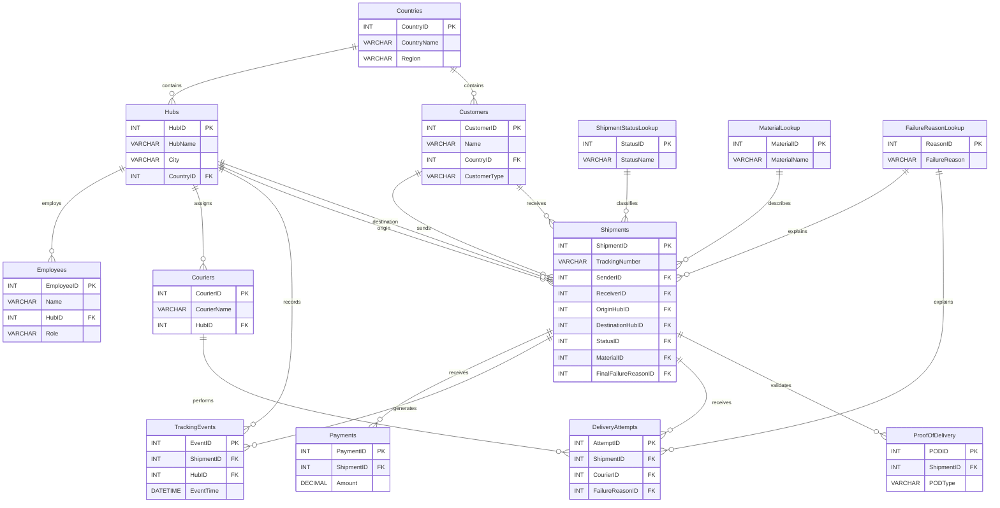

# Transportation & Logistics Database ERD

The SQL Server model contains 13 relational tables centered on `Shipments`. The operational tables are assumed/demo tables used to validate the proposed solution and query layer; they are not presented as part of the historical shipment KPI dataset.

